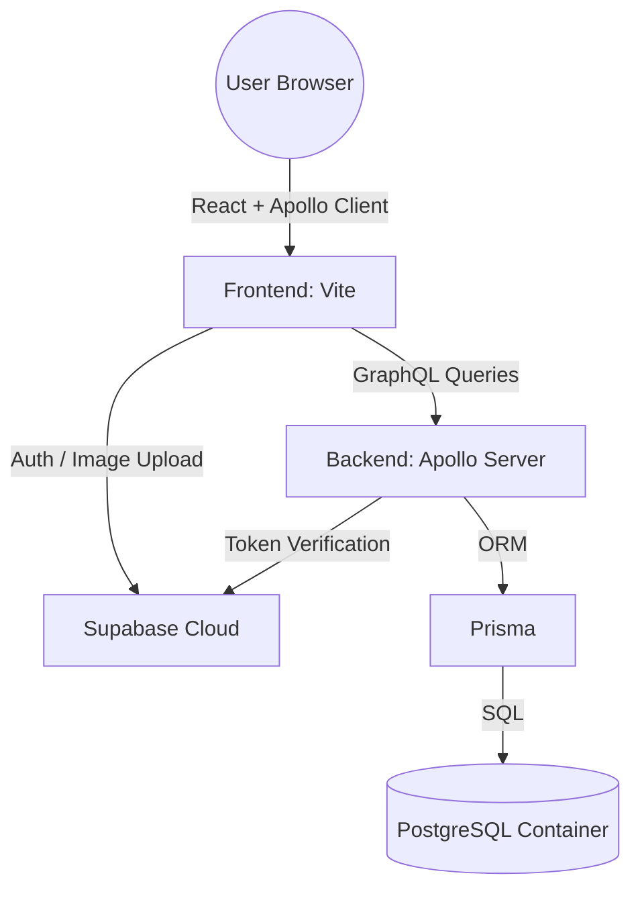

# 📸 Instagram Clone - Full Stack

A modern Instagram clone built with React, Node.js (Apollo GraphQL), Prisma, and Supabase. The entire environment is containerized with Docker for a seamless "one-command" setup.

---

## 🛠 Tech Stack

- **Frontend:** React, Typescript, Vite, Tailwind CSS, Apollo Client
- **Backend:** Node.js, Express.js, Typescript, Apollo Server (GraphQL), Prisma ORM
- **Database:** PostgreSQL (Local Docker) & Supabase PostgreSQL (Production)
- **Authentication & Storage:** Supabase (Auth & S3 Buckets)
- **Infrastructure:** Docker & Docker Compose

## 🌟 Project Features

- [x] **Secure Authentication**: Handled by Supabase Auth (JWT-based).
- [x] **GraphQL API**: Flexible data fetching with Apollo Server.
- [x] **Relational Data**: Complex user relationships (Followers, Posts, Likes, Comments) via Prisma & PostgreSQL.
- [x] **Dockerized Workflow**: One-command setup for DB, Backend, Frontend, and pgAdmin.
- [x] **Cloud Storage**: Profile pictures and posts stored in Supabase S3 buckets.
- [x] **Responsive UI**: Instagram-like experience built with Tailwind CSS.
- [ ] **Stories**: (Planned) Instagram-like post stories.
- [ ] **Real-time Notifications**: (Planned) Using GraphQL Subscriptions.
- [ ] **Direct Messaging**: (Planned) Peer-to-peer chat functionality.

## 🏗 System Architecture

The project splits concerns between **Identity** (Supabase) and **Application Data** (Postgres).



## 🚀 Quick Start Guide

```
git clone https://github.com/wickeddd3/instagram-clone.git
cd instagram-clone
# Fill in your .env files (see Configuration section)
```

### 1. Prerequisites

- [Docker Desktop](https://www.docker.com/products/docker-desktop/) installed.
- A [Supabase](https://supabase.com/) project created.
- A Supabase Storage bucket named **avatars**(set to public) and **posts**.

### 2. Environment Configuration

You need to create two .env files. One in the root of **Backend** and one in the **Frontend** folder.

- ### Backend folder root `.env`

```
# Database
DATABASE_URL=postgresql://root:root@db:5432/instagram_db

# Supabase Auth (Backend)
SUPABASE_URL=https://your-project-id.supabase.co
SUPABASE_SERVICE_KEY=your-service-role-key
```

- ### Frontend folder root `.env`

```
VITE_SUPABASE_URL=https://your-project-id.supabase.co
VITE_SUPABASE_ANON_KEY=your-anon-public-key
```

### 3. Local Setup

- ### Launch the Environment
  Run the following command to build and start all the services:

```
docker compose up --build
```

### Access the Apps

- **Frontend:** [http://localhost:5173](http://localhost:5173)
- **GraphQL Playground:** [http://localhost:4000/graphql](http://localhost:4000/graphql)
- **pgAdmin (Database UI):** [http://localhost:5050](http://localhost:5050)
  - Login: `root@root.com`
  - Host: `db` | User: `root` | Pass: `root`

## 🔗 Connection Details

| Service     | URL                             | Credentials          |
| ----------- | ------------------------------- | -------------------- |
| Frontend    | `http://localhost:5173`         | -                    |
| GraphQL API | `http://localhost:4000/graphql` | —                    |
| pgAdmin 4   | `http://localhost:5050 `        | root@root.com / root |

## 🛠 Database & Migrations

When you modify the `prisma/schema.prisma` file, you must sync the changes to the database container. Use the following guide:

### Synchronizing Schema (Development)

If you just want to push changes without creating a formal migration file:

```
docker compose exec instagram-backend npx prisma db push
```

### Creating a New Migration

To create a versioned migration file (recommended for tracking changes):

```
# 1. Create the migration
docker compose exec instagram-backend npx prisma migrate dev --name your_migration_name

# 2. Generate the Prisma Client
docker compose exec instagram-backend npx prisma generate
```

## 🛠 Troubleshooting

**DNS / Network Issues:** If the backend cannot reach Supabase, try restarting the Docker network:

```
docker compose down
docker network prune -f
docker compose up
```

**Missing Profiles:** If you log in but see no profile data, ensure the user exists in your local Postgres **Profile** table. You can check this via pgAdmin at **localhost:5050**.

## 📁 Project Structure

```
├── .github/
│   └── workflows/
│       ├── deploy-frontend.yml  # Global Action for Frontend
│       └── deploy-backend.yml   # Global Action for Backend
├── instagram-backend/ # Node.js + Apollo + Prisma
├── instagram-frontend/ # React + Vite
├── docker-compose.yml # Infrastructure orchestration

```

## 📄 License

This project is for educational purposes.
